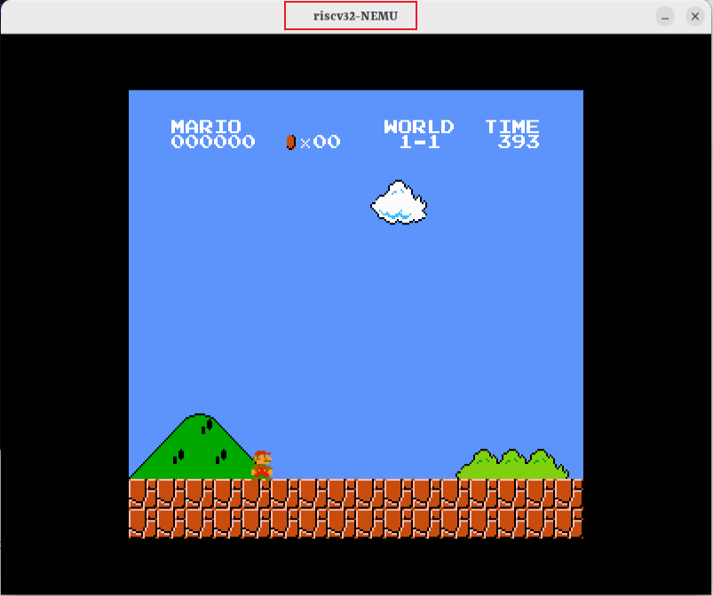

# ICS2021

在`nemu`下运行`make run`

`am-kernels/tests`下用来测试自己的代码正确性的

在`fceux-am`目录下运行`make ARCH=riscv32-nemu run mainargs=mario`，当然你需要安装交叉编译工具`riscv64-linux-gnu-gcc`和`riscv64-linux-gnu-g++`，最终效果如下图，以NEMU来运行超级玛丽，因为我是在虚拟机上运行的，运行帧率只有20fps

